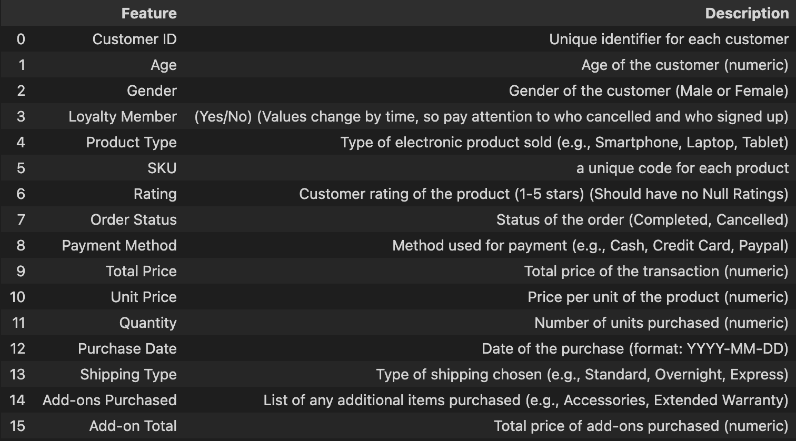
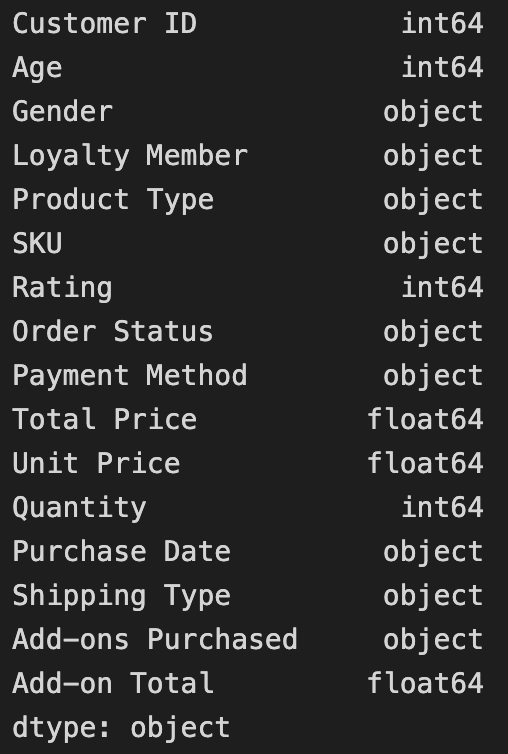
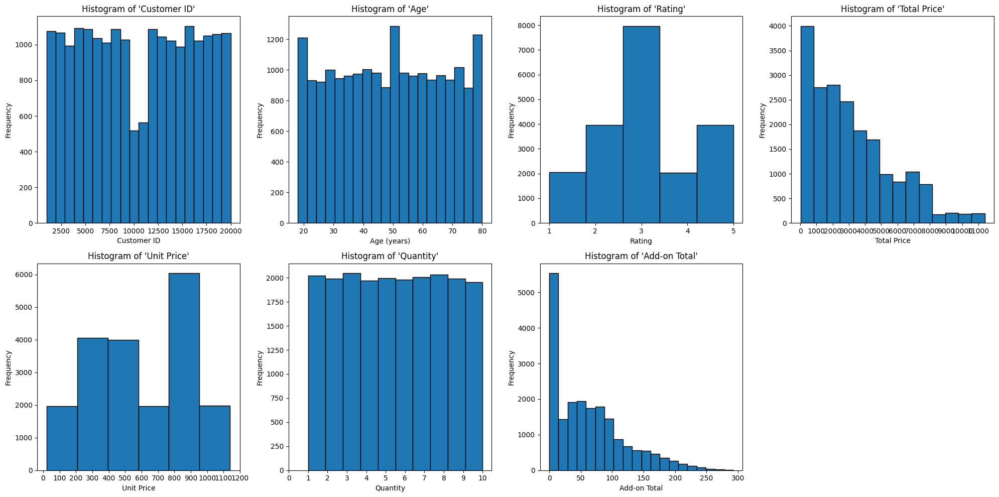
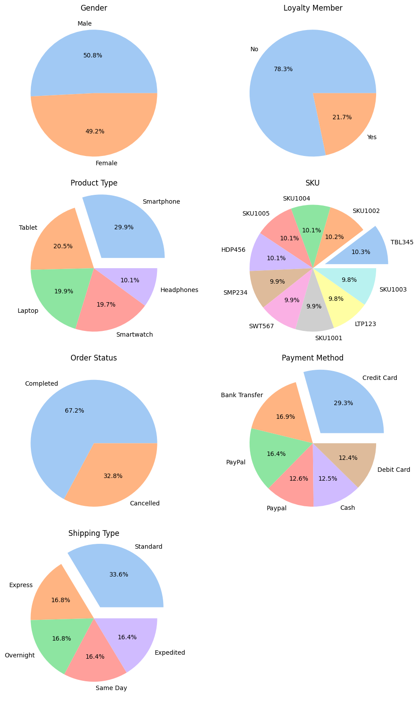
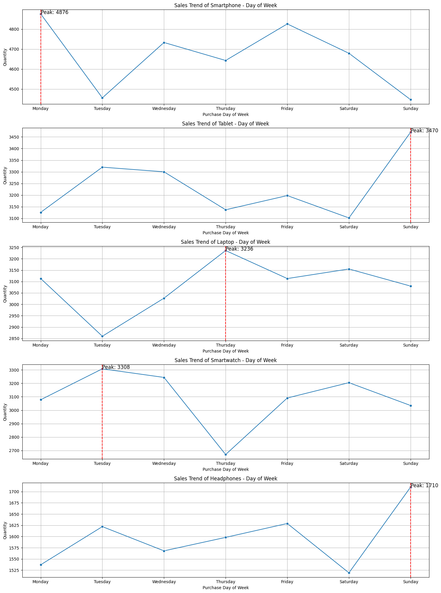
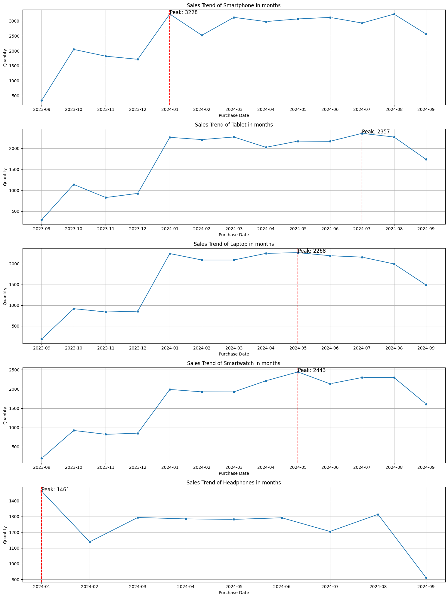
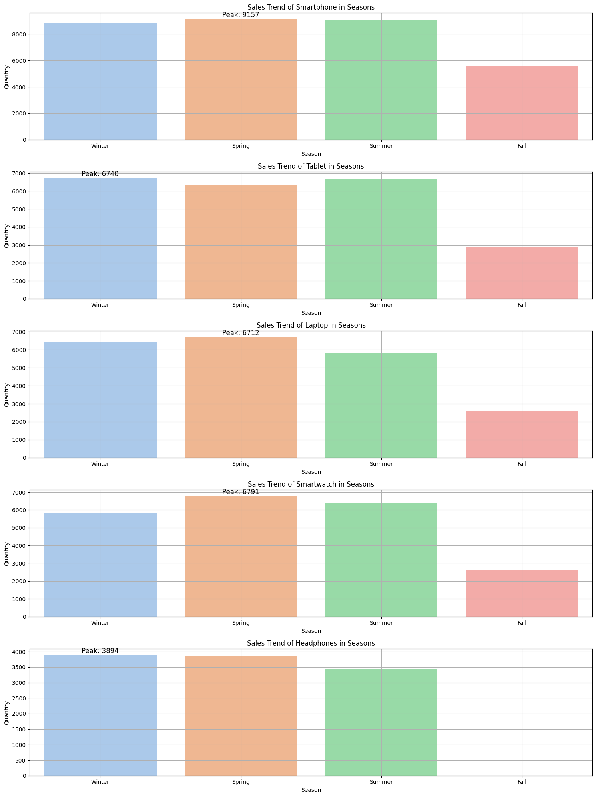
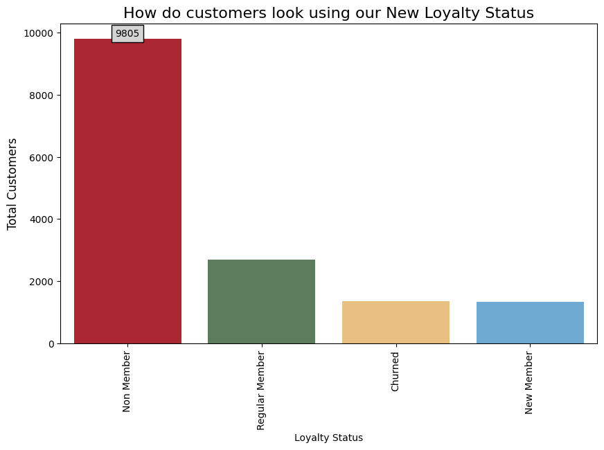
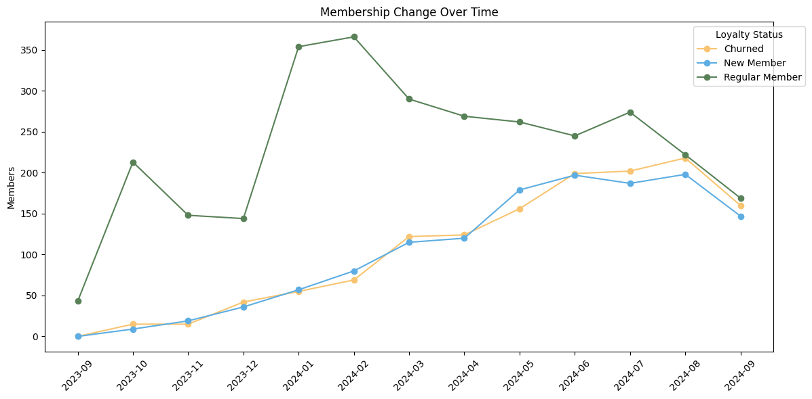

# CSC17104-Programming-for-Data-Science
Customer purchase behavior - Electronic Sales Data Project 

## I. Team members information:

- **Class:** 21KHDL

    |Student ID |Full name|
    |:--- |----:|
    |21127469 |Võ Thanh Tú|
    |22127117 |Lý Liên Hoa|
    |22127232 |Lê Thị Ngọc Linh|

- **Working Plan:** [Google sheet](https://docs.google.com/spreadsheets/d/1wnJ2Im7WxUYBzPZbPgQprs9gf-SFMRJHmO04_kE_N9g/edit?usp=sharing)

    

## II. Project information:
### 1. Dataset
The [dataset](https://www.kaggle.com/datasets/cameronseamons/electronic-sales-sep2023-sep2024), providing historical sales data of an electronics company, is designed to analyze business performance through 16 distinct features. It focuses on identifying sales trends, evaluating product performance, and assessing customer loyalty to optimize marketing strategies, enhance customer engagement, and drive growth in the electronics category.
### 2. Exploratory Data Analysis (EDA)
- **Column Meaning**
    

    
    

- **Column Types**
    

    
    

- **Distribution**
    - Numeric Values
    

    
    

    - Categorical Values
    

    
    

### 3. Asking Meaning Questions
**a. Question 1:**  How do day of the week, month and seasonal patterns affect sales performance across different product categories?

**Benefits:** 
- Enhances Inventory Planning: By analyzing how seasons and specific days of the week affect product demand, businesses can fine-tune their inventory management to avoid stockouts or excessive surplus.

- Optimizes Staffing Schedules: Understanding sales spikes during certain days or holiday seasons helps in effectively planning staff rosters and ensuring adequate staffing during peak times.

- Informs Marketing Campaign Timing: Sales promotions and marketing efforts are more impactful when scheduled during naturally high-demand periods. This also helps prevent wasted resources on underperforming days.

- Predicts Busy Periods: Accurately anticipating sales surges around weekends, holidays, or weather-driven events provides a clearer forecast of operational needs, improving overall customer satisfaction.

- Promotes Category-Specific Insights: Different products can behave differently under the same seasonal pattern. Identifying category-level nuances ensures you’re targeting the right mix of products at the right moment.

**How to answer this question:**

- Sales trend of each product type in days of the week pattern
    

    
    

- Sales trend of each product type in months pattern
    

    
    

- Sales trend of each product type in seasons pattern
    

    
    

**&rarr; Answer the question:** How do day of the week, month and seasonal patterns affect sales performance across different product categories?

- Based on the visualizations, here are the key insights about sales patterns:

1. Day of Week Patterns:
    - Smartphones show highest sales on Thursdays
    - Tablets peak on Mondays
    - Laptops have strongest sales on Fridays
    - Smartwatches sell best mid-week (Wednesday/Thursday)
    - Headphones show highest sales early week (Monday/Tuesday)
2. Monthly Patterns:
    - Most products show cyclical patterns with peaks every 3-4 months
    - January and July tend to be strong months across categories
    - Significant dips observed in February and September
    - Holiday season (December) shows increased sales for most categories
4. Seasonal Trends:
    - Winter season leads sales for most product categories
    - Spring follows as second strongest season
    - Summer shows moderate sales performance
    - Fall generally has lowest sales numbers
    - Electronics buying follows typical retail seasonality with stronger performance during winter holidays

**b. Question 2:**  How do loyalty membership statuses evolve over time, and what are the trends in customer behavior regarding membership transitions (e.g., New Member, Regular Member, Churned, Non Member)?

**Benefits:**
- Analyzing the evolution of loyalty membership statuses provides valuable insights into customer behavior and program effectiveness. 

- Understanding these trends helps businesses identify patterns in member retention, new member acquisition, and churn rates. 

- This knowledge enables companies to design targeted loyalty strategies, such as personalized offers for retaining regular members or re-engaging churned customers. 

- By leveraging these insights, businesses can enhance customer satisfaction, increase program participation, and drive long-term revenue growth.

**How to answer this question:**

- Count the Loyalty Members we need to look at UNIQUE customer_ID and count new member status counts
- Visualize New status memberships
    

    
    

- Visualize membership over time
    

    
    

**&rarr; Answer the question:** How do loyalty membership statuses evolve over time, and what are the trends in customer behavior regarding membership transitions (e.g., New Member, Regular Member, Churned, Non Member)?
- The analysis shows clear trends in loyalty membership transitions. Most customers are "Regular Members," reflecting consistent loyalty, while "New Members" and "Churned" statuses indicate dynamic shifts. Peaks in "New Members" suggest effective acquisition efforts, while increases in "Churned" highlight retention challenges. Tracking these trends helps businesses refine loyalty programs, improve retention strategies, and enhance customer satisfaction.

