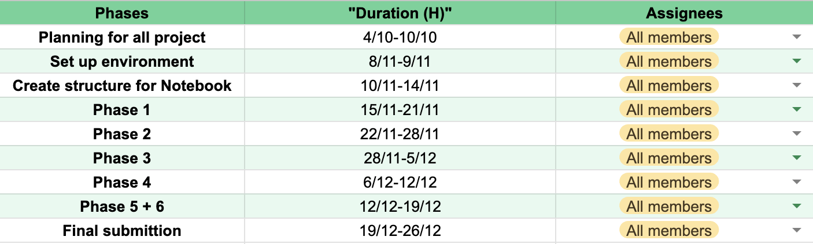
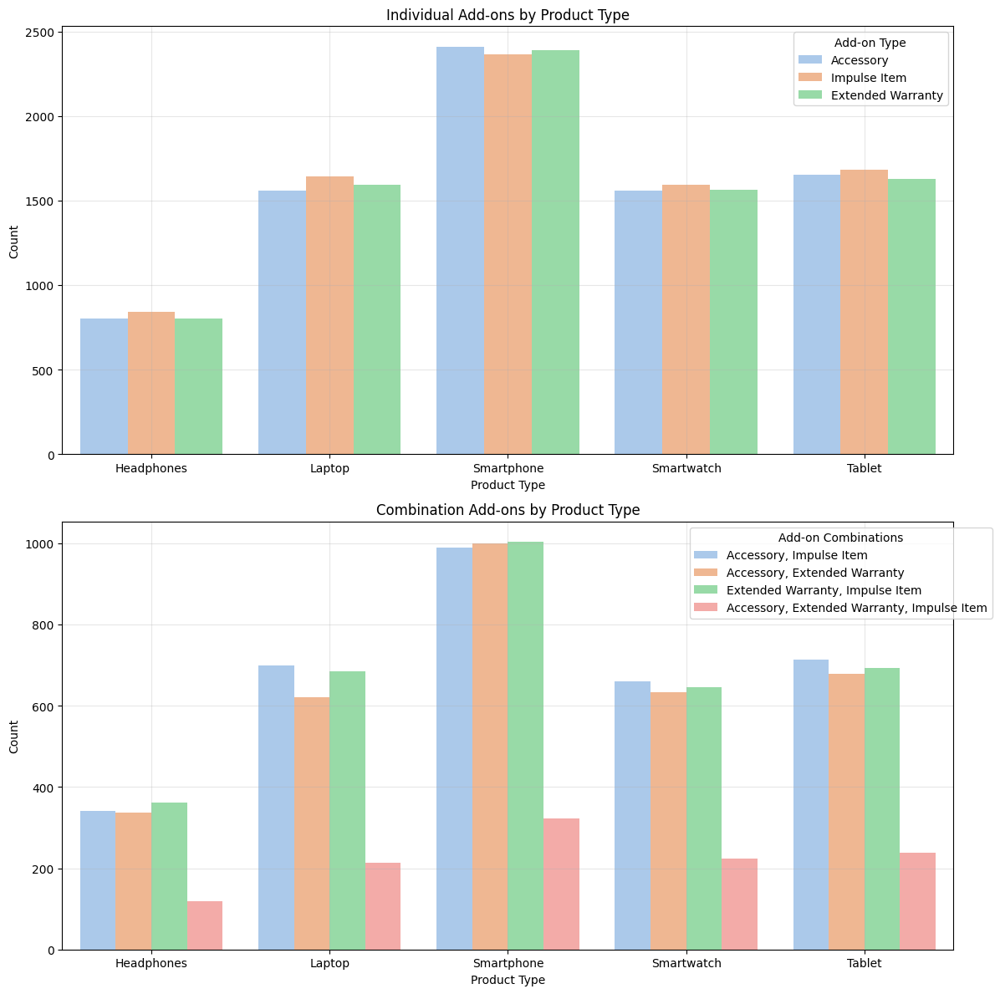

# CSC17104-Programming-for-Data-Science
Customer purchase behavior - Electronic Sales Data Project 

## I. Team members information:

- **Class:** 21KHDL

    |Student ID |Full name|
    |:--- |----:|
    |21127469 |Võ Thanh Tú|
    |22127117 |Lý Liên Hoa|
    |22127232 |Lê Thị Ngọc Linh|

- **Working Plan:** [Google sheet](https://docs.google.com/spreadsheets/d/1wnJ2Im7WxUYBzPZbPgQprs9gf-SFMRJHmO04_kE_N9g/edit?usp=sharing)

    

## II. Project information:
### 1. Dataset
The [dataset](https://www.kaggle.com/datasets/cameronseamons/electronic-sales-sep2023-sep2024), providing historical sales data of an electronics company, is designed to analyze business performance through 16 distinct features. It focuses on identifying sales trends, evaluating product performance, and assessing customer loyalty to optimize marketing strategies, enhance customer engagement, and drive growth in the electronics category.
### 2. Exploratory Data Analysis (EDA)
- **Column Meaning**
    

    
    

- **Column Types**
    

    
    

- **Distribution**
    - Numeric Values
    

    
    

    - Categorical Values
    

    
    

### 3. Asking Meaning Questions
**a. Question 1:**  How do day of the week, month and seasonal patterns affect sales performance across different product categories?

**Benefits:** 
- Enhances Inventory Planning: By analyzing how seasons and specific days of the week affect product demand, businesses can fine-tune their inventory management to avoid stockouts or excessive surplus.

- Optimizes Staffing Schedules: Understanding sales spikes during certain days or holiday seasons helps in effectively planning staff rosters and ensuring adequate staffing during peak times.

- Informs Marketing Campaign Timing: Sales promotions and marketing efforts are more impactful when scheduled during naturally high-demand periods. This also helps prevent wasted resources on underperforming days.

- Predicts Busy Periods: Accurately anticipating sales surges around weekends, holidays, or weather-driven events provides a clearer forecast of operational needs, improving overall customer satisfaction.

- Promotes Category-Specific Insights: Different products can behave differently under the same seasonal pattern. Identifying category-level nuances ensures you’re targeting the right mix of products at the right moment.

**How to answer this question:**

- Sales trend of each product type in days of the week pattern
    

    
    

- Sales trend of each product type in months pattern
    

    
    

- Sales trend of each product type in seasons pattern
    

    
    

**&rarr; Answer the question:** How do day of the week, month and seasonal patterns affect sales performance across different product categories?

- Based on the visualizations, here are the key insights about sales patterns:

1. Day of Week Patterns:
    - Smartphones show highest sales on Thursdays
    - Tablets peak on Mondays
    - Laptops have strongest sales on Fridays
    - Smartwatches sell best mid-week (Wednesday/Thursday)
    - Headphones show highest sales early week (Monday/Tuesday)
2. Monthly Patterns:
    - Most products show cyclical patterns with peaks every 3-4 months
    - January and July tend to be strong months across categories
    - Significant dips observed in February and September
    - Holiday season (December) shows increased sales for most categories
4. Seasonal Trends:
    - Winter season leads sales for most product categories
    - Spring follows as second strongest season
    - Summer shows moderate sales performance
    - Fall generally has lowest sales numbers
    - Electronics buying follows typical retail seasonality with stronger performance during winter holidays

**b. Question 2:**  How do loyalty membership statuses evolve over time, and what are the trends in customer behavior regarding membership transitions (e.g., New Member, Regular Member, Churned, Non Member)?

**Benefits:**
- Analyzing the evolution of loyalty membership statuses provides valuable insights into customer behavior and program effectiveness. 

- Understanding these trends helps businesses identify patterns in member retention, new member acquisition, and churn rates. 

- This knowledge enables companies to design targeted loyalty strategies, such as personalized offers for retaining regular members or re-engaging churned customers. 

- By leveraging these insights, businesses can enhance customer satisfaction, increase program participation, and drive long-term revenue growth.

**How to answer this question:**

- Count the Loyalty Members we need to look at UNIQUE customer_ID and count new member status counts
- Visualize New status memberships
    

    
    

- Visualize membership over time
    

    
    

**&rarr; Answer the question:** How do loyalty membership statuses evolve over time, and what are the trends in customer behavior regarding membership transitions (e.g., New Member, Regular Member, Churned, Non Member)?
- The analysis shows clear trends in loyalty membership transitions. Most customers are "Regular Members," reflecting consistent loyalty, while "New Members" and "Churned" statuses indicate dynamic shifts. Peaks in "New Members" suggest effective acquisition efforts, while increases in "Churned" highlight retention challenges. Tracking these trends helps businesses refine loyalty programs, improve retention strategies, and enhance customer satisfaction.

**b. Question 3:**  With each product type, which kind of items that customer usually purchase more?

**Benefits:**
- When customers buy a product, we can know what kind of items they will add more. By understanding these purchasing behaviors and identifying patterns, businesses can anticipate customer needs, offer relevant add-ons, and create tailored marketing strategies. 
- This approach not only improves customer satisfaction by meeting their expectations but also enables the company to increase revenue through targeted upselling, bundling, and strategic placement of high-demand add-ons during the purchasing journey.

**How to answer this question:**

- Visualize
    

    
    

**&rarr; Answer the question:**  With each product type, which kind of items that customer usually purchase more?

Through the firts chart we have some key observation:
- **Smartphones** are the products with the highest number of accessories (Accessories), impulse purchases (Impulse Items), and extended warranties (Extended Warranty) compared to other products.
- **Tablet and Smartwatch** products have a relatively equal number of Add-ons.
- **Headphones** have the lowest number of Add-ons in all three categories, especially accessories and extended warranties.

With the seconds chart, we have:
- **Smartphones** continue to lead in the number of combined Add-ons (Accessory, Impulse Item, Extended Warranty). **Tablets** is just behind Smartphones, which have a relatively high number Add-ons. Finally, the lowest one is belonging to **Headphones** products.
- **Laptops and Tablets** have a high number of Add-ons combined, especially in the (Accessory + Impulse Item) and (Extended Warranty + Impulse Item) combinations.
- **Headphones and Smartwatches** have lower numbers in the Add-ons combination, especially the (Accessory + Extended Warranty) combination.
- Accessory, Extended Warranty, Impulse Item combination (combining all 3 types) is the least common of all products.

We can have some insights about that: 
- **Smartphones** are often products that require a lot of accompanying accessories, are easy to buy impluse items (like screen protectors) and have extended warranties due to their high value. Smartphones also are products that easily encourage customers to buy many Add-ons. From that, we can develop marketing strategies to attact more customer and increase revenue.
- When purchasing **Laptops, Tablets and Smartwatches**, customers tend to buy accessories along with impulse items. For example, we can increase awareness of Add-ons combinations through advertising of complementary products.
- **Headphones** rarely attract Add-ons, possibly because the products often only need basic accessories or are of little value to invest in extended warranties. So bussiness need a strategy to focus on promoting Add-ons for Headphones, because this is the least profitable product through Add-ons.
